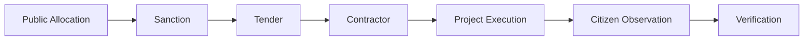
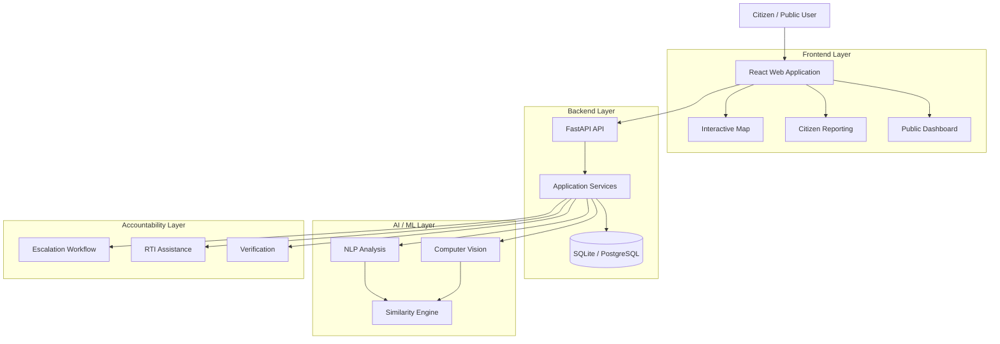

<div align="center">

# 🏛️ Accountable

### Civic Transparency & Public Audit Platform

**From Sanction → Spending → Execution → Verification**

<p>
  
  
  
</p>

<p><strong>Making public projects easier to track, understand, verify, and question.</strong></p>

</div>

---


>**! IMPORTANT !**  
> **Accountable is currently a concept / prototype.** The features, architecture, AI workflows, APIs, integrations, and escalation processes described in this README represent the proposed direction of the project. They are not claims of a deployed government platform, verified public records, or legally validated procedures.

## 📌 Table of Contents

- [💡 About the Project](#-about-the-project)
- [🎯 Problem](#-problem)
- [🚀 Vision](#-vision)
- [🔄 How It Works](#-how-it-works)
- [✨ Proposed Features](#-proposed-features)
- [🤖 AI-Assisted Analysis](#-ai-assisted-analysis)
- [💰 Public Fund Trail](#-public-fund-trail)
- [⏱️ Escalation Concept](#️-escalation-concept)
- [🏗️ Architecture](#️-architecture)
- [🛠️ Technology Stack](#️-technology-stack)
- [📁 Project Structure](#-project-structure)
- [🗺️ Pilot: Bhatkal](#️-pilot-bhatkal)
- [🔐 Responsible AI & Transparency](#-responsible-ai--transparency)
- [🛣️ Roadmap](#️-roadmap)
- [🧪 Development Approach](#-development-approach)
- [🤝 Contributing](#-contributing)
- [📜 License](#-license)
- [⚠️ Disclaimer](#️-disclaimer)

---

## 💡 About the Project

**Accountable** is a proposed civic-tech platform designed to make public infrastructure projects, public spending, contractor information, and citizen grievances easier to understand and monitor.

The core idea is to connect information that is often scattered across different systems:

```text
Public Funds
     ↓
Tenders
     ↓
Contractors
     ↓
Project Execution
     ↓
Citizen Reports
     ↓
Verification
     ↓
Accountability
```

Instead of citizens having to navigate multiple sources independently, Accountable aims to provide a unified view of the public-project lifecycle.

---

## 🎯 Problem

Citizens often struggle to answer simple questions about public infrastructure:

- Where was public money allocated?
- What was the money intended for?
- Which contractor received the work?
- What was the sanctioned amount?
- How much was reportedly released or utilized?
- Is the project actually being completed?
- Why has a project been delayed?
- Have other citizens reported the same issue?
- What happens when a complaint remains unresolved?

The information may exist, but it can be spread across tenders, financial records, departmental systems, notices, and local observations.

### The proposed solution

Accountable brings these relationships into one place and provides tools for **reporting, discovery, analysis, and verification**.

---

## 🚀 Vision

> ### **Turn public information into public understanding — and public participation into measurable accountability.**

Accountable is built around five simple stages:

| Stage | Goal |
|---|---|
| 🗺️ **Observe** | Understand projects and civic issues |
| 📢 **Report** | Allow citizens to report problems |
| 🔎 **Connect** | Link reports with projects, funds, tenders, and contractors |
| 🤖 **Analyze** | Surface potentially useful patterns using AI/ML |
| ✅ **Verify** | Keep humans involved before information is treated as confirmed |

---

## 🔄 How It Works

```text
                         PUBLIC PROJECT
                               │
                ┌──────────────┴──────────────┐
                ▼                             ▼
        FUND INFORMATION                 TENDER DATA
                │                             │
                └──────────────┬──────────────┘
                               ▼
                         CONTRACTOR
                               │
                               ▼
                       PROJECT EXECUTION
                               │
                ┌──────────────┴──────────────┐
                ▼                             ▼
        CITIZEN REPORTS                  PROJECT DATA
                │                             │
                └──────────────┬──────────────┘
                               ▼
                        AI-ASSISTED ANALYSIS
                               │
                               ▼
                         HUMAN REVIEW
                               │
                               ▼
                           VERIFIED
                               │
                               ▼
                        ACCOUNTABILITY
```

---

# ✨ Proposed Features

## 1. 🗺️ Issue Map & Geo-Tracking

A proposed interactive map for visualizing civic issues and public projects.

### Possible capabilities

- Interactive map
- Municipal ward boundaries
- Issue categories
- Severity indicators
- Status filtering
- Project-linked reports
- Location-based search

### Example categories

`Pothole` · `Drainage` · `Garbage` · `Water Leak` · `Streetlight` · `Encroachment`

---

## 2. 📸 Snap & Tag Citizen Reporting

A mobile-first reporting experience designed for quick field reporting.

```text
Capture Photo
     ↓
Add Description
     ↓
Capture Location
     ↓
Select Category
     ↓
Submit Report
     ↓
Tracking ID
```

Potential report information:

- Photos
- Description
- GPS location
- Timestamp
- Category
- Ward
- Project reference

---

## 3. 🔍 Potential Duplicate Detection

The platform could identify reports that may refer to the same physical issue.

### Proposed pipeline

```text
Citizen Report
      │
      ▼
Location Similarity
      │
      ▼
Image Similarity
      │
      ▼
Text Similarity
      │
      ▼
Potential Match
      │
      ▼
Human Review
```

Possible techniques:

- Haversine distance
- OpenCV image comparison
- ORB feature matching
- TF-IDF cosine similarity

> A similarity score would indicate a **potential relationship**, not prove that two reports are identical.

---

## 4. 🧠 NLP Tender & Procurement Matching

Citizen reports could potentially be matched against relevant tender and procurement information.

```text
Complaint / Tender
        │
        ▼
Text Processing
        │
   ┌────┴────┐
   ▼         ▼
  NER     Keywords
   │         │
   └────┬────┘
        ▼
Semantic Embeddings
        │
        ▼
Similarity Score
        │
        ▼
Candidate Match
```

Potential technologies:

- spaCy
- YAKE
- Sentence Transformers
- `all-MiniLM-L6-v2`

The purpose is to surface potentially relevant records for further investigation.

---

## 5. 🕸️ Contractor Relationship Intelligence

A proposed network view could connect publicly available contractor information.

```text
                    Contractor
                        │
          ┌─────────────┼─────────────┐
          ▼             ▼             ▼
      Directors      Addresses      Tenders
          │                           │
          └─────────────┬─────────────┘
                        ▼
                     Projects
```

Potential indicators could include:

- Shared directors
- Shared registered addresses
- Recurring tender relationships
- Contractor-project history
- Geographic overlap

> These are **investigative indicators only**. Automated relationships should never be treated as proof of fraud, collusion, or illegal activity.

---

## 6. ⏱️ Escalation Workflow

A proposed workflow can track unresolved complaints and move them through configured authority levels.

```text
Issue Reported
      │
      ▼
 Initial Handling
      │
      ▼
 Local Escalation
      │
      ▼
 District Review
      │
      ▼
 Higher-Level Review
      │
      ▼
 Information Request / RTI Assistance
```

The actual authority structure and deadlines would need to be configured according to the applicable local procedures.

---

## 7. 📄 RTI Assistance

Accountable could help citizens prepare a structured RTI application draft when additional public information is required.

Potential output:

- Project reference
- Tender details
- Financial questions
- Relevant authority / PIO details
- Structured application document

> The platform would provide **RTI assistance**, not claim that an automatically generated document is legally validated or automatically filed.

---

## 8. 💰 Public Fund Trail

A central concept is making the financial lifecycle of a public project easier to understand.

```text
┌──────────────┐
│   Sanction   │
└──────┬───────┘
       ↓
┌──────────────┐
│   Released   │
└──────┬───────┘
       ↓
┌──────────────┐
│   Utilized   │
└──────┬───────┘
       ↓
┌──────────────┐
│  Execution   │
└──────┬───────┘
       ↓
┌──────────────┐
│ Verification │
└──────────────┘
```

Potential analysis:

- Fund allocation
- Reported expenditure
- Project status
- Delays
- Cost changes
- Missing information

Financial information should retain a clear source and provenance.

---

## 9. 🏆 Civic Gamification

The concept could encourage constructive participation through recognition rather than simply rewarding high complaint volume.

### 🏅 Badges

- First Snap
- Pothole Patrol
- Fund Sleuth
- Ward Champion
- Civic Marathon

### 🏆 Ranks

- Civic Observer
- Community Reporter
- Ward Watchdog

### 📊 Community Metrics

- Verified reports
- Resolved issues
- Community impact
- Ward participation

---

# 🤖 AI-Assisted Analysis

Accountable's proposed AI layer follows one principle:

> **AI identifies patterns. Humans verify them.**

```text
                 CITIZEN REPORT
                       │
             ┌─────────┴─────────┐
             ▼                   ▼
         TEXT DATA           IMAGE DATA
             │                   │
             ▼                   ▼
            NLP                  CV
             │                   │
             └─────────┬─────────┘
                       ▼
              Similarity Signals
                       │
                       ▼
                Risk Indicators
                       │
                       ▼
                 Human Review
                       │
                       ▼
                  Verification
```

### Proposed AI components

| Component | Technology | Purpose |
|---|---|---|
| Text similarity | TF-IDF | Compare report descriptions |
| Semantic similarity | Sentence Transformers | Compare document meaning |
| Entity extraction | spaCy | Identify entities and locations |
| Keyword extraction | YAKE | Extract important terms |
| Image analysis | OpenCV | Compare visual characteristics |
| Spatial matching | Haversine | Identify nearby reports |

---

# 💰 Public Fund & Project Relationship

The platform aims to connect financial records with physical project information.



This relationship helps answer:

> **What was planned → Who received the work → What was funded → What happened on the ground?**

---

# ⏱️ Escalation Concept

A conceptual timeline for the prototype:

| Level | Suggested Window | Purpose |
|---|---:|---|
| **T1** | 0–72 hours | Initial complaint handling |
| **T2** | 72–120 hours | Local escalation |
| **T3** | 120–168 hours | District review |
| **T4** | 168–336 hours | Higher-level review |
| **RTI** | After 336 hours | Information request assistance |

```text
DAY 0
  │
  ▼
T1 — Initial Handling
  │
  ▼
DAY 3
  │
  ▼
T2 — Local Escalation
  │
  ▼
DAY 5
  │
  ▼
T3 — District Review
  │
  ▼
DAY 7
  │
  ▼
T4 — Higher Review
  │
  ▼
DAY 14
  │
  ▼
RTI Assistance
```

> ⚠️ These are **conceptual workflow values**, not statutory deadlines.

---

# 🏗️ Architecture



---

# 🛠️ Technology Stack

## Frontend

| Technology | Role |
|---|---|
| React | User interface |
| TypeScript | Type-safe development |
| Vite / TanStack tooling | Application tooling |
| Tailwind CSS | Styling |
| Leaflet / React-Leaflet | Maps |
| Radix UI | Accessible UI primitives |
| Lucide React | Icons |

## Backend

| Technology | Role |
|---|---|
| Python | Backend language |
| FastAPI | REST API |
| SQLAlchemy | ORM |
| Pydantic | Validation and settings |
| Uvicorn | ASGI server |

## AI / Data

| Technology | Role |
|---|---|
| OpenCV | Computer vision |
| scikit-learn | Classical ML / similarity |
| spaCy | NLP / entity extraction |
| YAKE | Keyword extraction |
| Sentence Transformers | Semantic embeddings |
| SQLite | Development database |
| PostgreSQL | Potential production database |

## Document Generation

- ReportLab
- Jinja2

---

# 📁 Project Structure

```text
accountable/
│
├── README.md
├── LICENSE
├── .gitignore
│
├── frontend/
│   ├── package.json
│   ├── vite.config.ts
│   ├── tsconfig.json
│   └── src/
│       ├── routes/
│       ├── components/
│       ├── services/
│       ├── styles.css
│       └── router.tsx
│
├── backend/
│   ├── requirements.txt
│   └── app/
│       ├── main.py
│       ├── config.py
│       ├── crud.py
│       ├── schemas.py
│       ├── database/
│       │   ├── db.py
│       │   └── models.py
│       └── services/
│           ├── cv_deduplication.py
│           ├── nlp_tender_match.py
│           ├── escalation_worker.py
│           └── rti_pdf_gen.py
│
├── ai/
│   ├── nlp/
│   ├── vision/
│   └── similarity/
│
└── docs/
```

> The structure is **conceptual** and may change as implementation progresses.

---

# 🗺️ Pilot : Bhatkal

## 🇮🇳 Bhatkal, Karnataka

The initial concept focuses on **Bhatkal** as a manageable pilot geography.

Potential areas of focus:

- 🛣️ Roads
- 🚰 Water infrastructure
- 🌧️ Drainage
- 💡 Streetlights
- 🗑️ Waste management
- 🏢 Public buildings
- 🏗️ Government-funded infrastructure
- 📢 Citizen-reported civic issues

A focused pilot makes it easier to test the platform's usability, data model, verification process, and community impact before considering expansion.

---

# 🔐 Responsible AI & Transparency

A platform designed to promote accountability must itself be accountable.

### Core principles

- **AI outputs are indicators, not proof.**
- Citizen reports must be distinguished from verified records.
- Public financial information should retain its source.
- Sensitive citizen information should be protected.
- Automated decisions should be explainable where practical.
- Allegations must not be presented as established facts.
- High-impact decisions should include human review.
- Data provenance should be maintained.
- Legal workflows must be reviewed before real-world deployment.

### Information states

```text
┌──────────┐
│ REPORTED │
└────┬─────┘
     ↓
┌──────────┐
│ ANALYZED │
└────┬─────┘
     ↓
┌──────────┐
│ VERIFIED │
└──────────┘
```

This separation helps prevent a citizen allegation or AI prediction from being mistaken for a confirmed fact.

---

# 🛣️ Roadmap

## Phase 1 — Concept & Prototype

- [ ] Public dashboard
- [ ] Citizen reporting interface
- [ ] Interactive issue map
- [ ] Project database
- [ ] Fund-flow visualization

## Phase 2 — Intelligence Layer

- [ ] Potential duplicate detection
- [ ] NLP document analysis
- [ ] Tender similarity matching
- [ ] Image-assisted comparison
- [ ] Contractor relationship visualization

## Phase 3 — Accountability

- [ ] Escalation workflow
- [ ] Notification system
- [ ] RTI draft assistance
- [ ] Audit history
- [ ] Verification workflow

## Phase 4 — Future Possibilities

- [ ] Multilingual interface
- [ ] Kannada / Hindi / Urdu voice intake
- [ ] WhatsApp / Telegram reporting
- [ ] Satellite-assisted change detection
- [ ] Drone-assisted project verification
- [ ] Open-data exports
- [ ] Cryptographic data notarization

---

# 🧪 Development Approach

The project is intended to be developed incrementally:

```text
PLAN
  ↓
BUILD
  ↓
TEST
  ↓
INTEGRATE
  ↓
TEST AGAIN
  ↓
END-TO-END VALIDATION
  ↓
ITERATE
```

The development philosophy emphasizes:

- Small, testable components
- Clear data models
- Simple user experiences
- Responsible AI
- Source-backed information
- Security and privacy
- Human verification

---

# 🤝 Contributing

Contributions and ideas are welcome from:

- Developers
- Designers
- Data scientists
- Researchers
- Civic-tech enthusiasts
- Urban planners
- Policy researchers

### Quick start

```bash
git clone <repository-url>
cd accountable
```

Create a feature branch:

```bash
git checkout -b feature/your-feature
```

Make your changes, test them, and open a pull request.

---

# 📜 License

This project is intended to use the **MIT License**.

See [`LICENSE`](LICENSE) for the complete license text.

---

# ⚠️ Disclaimer

Accountable is currently a **concept / prototype project**.

It is **not an official government platform** and does not represent or speak on behalf of any government department, municipality, elected representative, or public authority.

The project does not claim that:

- Financial records are automatically verified.
- AI-generated indicators prove fraud, corruption, collusion, or wrongdoing.
- Contractor relationships establish illegal activity.
- Citizen reports are automatically factual.
- Generated RTI documents are automatically legally valid.
- Proposed escalation timelines are statutory deadlines.

A real-world deployment would require appropriate:

- Government and public-data integrations
- Legal and regulatory review
- Privacy and security controls
- Data provenance and verification
- Administrative cooperation
- Human oversight
- Accessibility and language support

---

<div align="center">

## 🏛️ Accountable

### **Build transparency. Follow the money. Verify reality.**

*An open-source concept for a more transparent civic future.*

</div>
